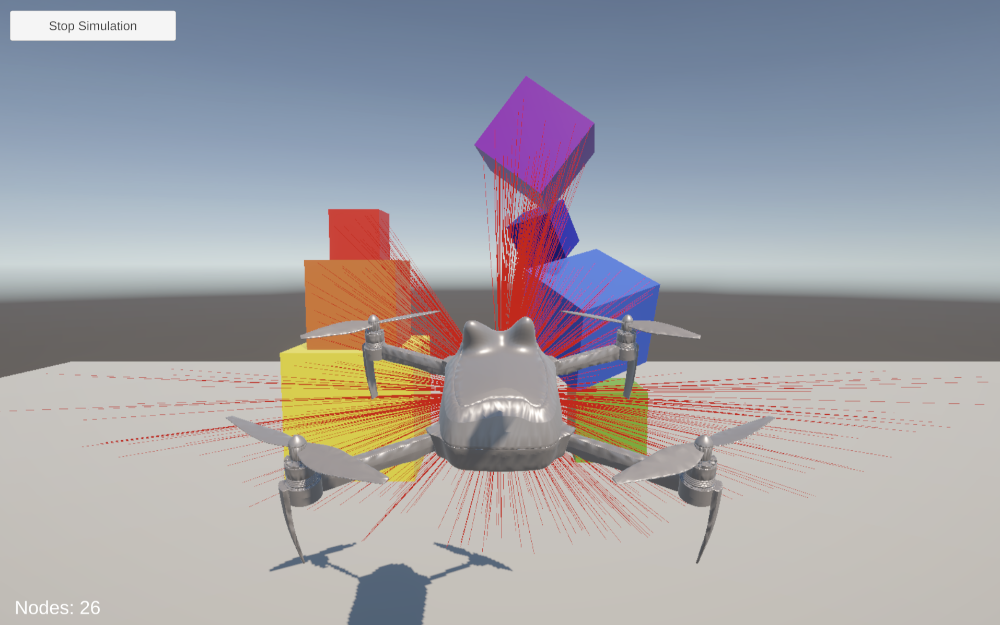
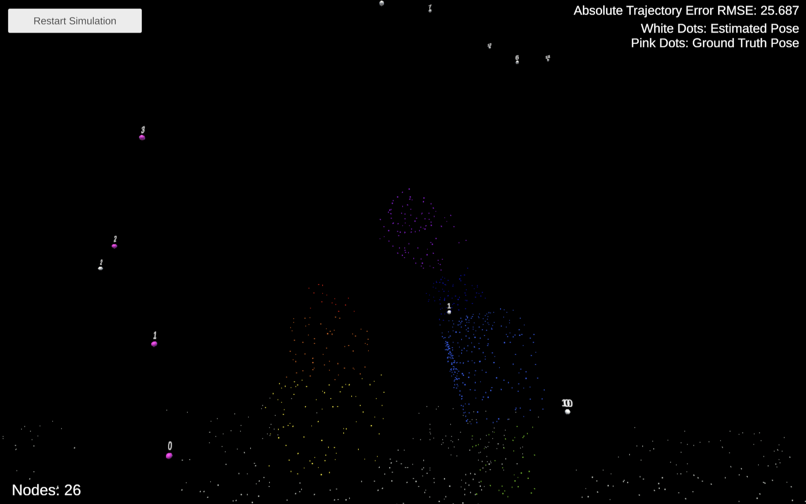
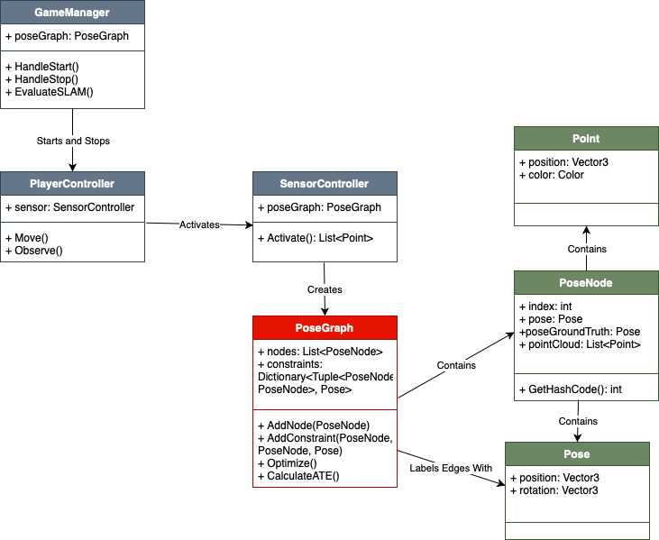

# slam-exploration

Authors: Andrew Cheung, Jia Jiang, Joel Puthankalam, Jack Krammer, and Jerry Tang

The SLAM Simulation is available at: https://cheung2710.itch.io/slam-simulation.

## Background
SLAM stands for Simultaneous Localization and Mapping, which means 1) building a map of an unknown environment while 2) keeping track of your location within the environment. SLAM is known as a “chicken-or-egg” problem — it’s easy to make a map if you know where you are, and it’s easy to know where you are with a good map, but it’s hard to do both at the same time. SLAM is applied in many autonomous navigation systems, including drones, submarines, and space rovers.

For more information, see [Andrew's Dynamic SLAM article](https://medium.com/@cheung2710/knowledge-in-dynamic-slam-1244c3f6aa03).

## Project Description
We explored SLAM by 1) implementing a simulation in Unity and 2) attempting to do SLAM with a real drone. We successfully implemented the simulation, which allows the user to fly a drone around a colorful environment. The simulated sensor creates nodes in a pose graph, and the graph is optimized to estimated the drone's trajectory. The user can compare the estimated and ground truth trajectories in a point cloud map. For the second phase, we searched for SLAM libraries, but many of them required more computing power than we had on our drone, or performed poorly on our video footage. We wanted to try [Jetson-SLAM](https://github.com/ashishkumar822/Jetson-SLAM), but we broke a propeller on our drone and we couldn't get a new one in time. So, we implemented a simple web app interface for [MASt3R-SLAM](https://github.com/rmurai0610/MASt3R-SLAM), which takes video as input and produces a point cloud map.

## SLAM Simulation

### Instructions
1. Click "Start Simulation".
2. Use WASD to move around, Space to go up, and Shift to go down. Use J and L to turn left and right, and I and K to look up and down. Press P to stabilize. Press E to toggle the sensor, which will automatically add nodes to the pose graph.
3. Click "Stop Simulation" in the top left corner. White dots will appear to represent pose graph nodes with simulated error, and magenta dots will appear to show the ground truth trajectory. Particles will appear to display the point cloud map. You can move around with the same controls.
4. Click "Restart Simulation" to do it again.

### Examples

<i>Simulated Environment</i>

<i>Point Cloud Map</i>

### System Diagram

## SLAM Web App
Instructions:
1. Clone [MASt3R-SLAM](https://github.com/rmurai0610/MASt3R-SLAM) repository.
2. Change global path of code in `app.py`.
3. Use `python3 app.py` to run.

## Acknowledgements
Cyrill Stachniss's online course materials were extremely helpful for learning about graph-based SLAM. We recommend his lecture about [Graph-based SLAM using Pose Graphs](https://www.youtube.com/watch?v=uHbRKvD8TWg), which is part of the [Mobile Sensing And Robotics 2 – Stachniss (2021)](https://www.ipb.uni-bonn.de/msr2-2021/index.html) series. The course materials can be found on [this](https://www.ipb.uni-bonn.de/teaching/index.html) page.

Huge thanks to our Professor, Franz Kurfess, for his support throughout the whole project!
